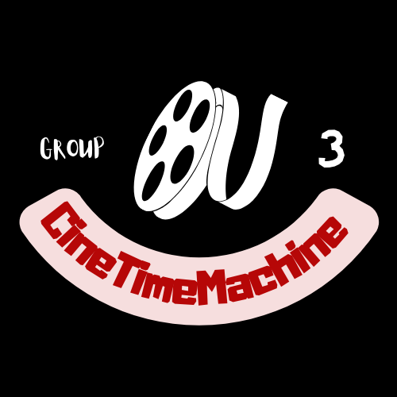

# Movie-Rate-Prediction

<div align="center">
	
</div>

## Install
* You must download imdb.db from the link below and put it in the root directory as the project.
https://drive.google.com/file/d/1Uo_KcOOnmFuFtQIayisgQRBMy3UtVbyc/view?usp=sharing
* Deploy the development environment
    #### Linux
    ```shell
    $ virtualenv venv
    $ source ./venv/bin/activate
    $ pip install -r requirements.txt
    ```
    #### MacOS
    ```shell
    $ virtualenv venv
    $ source ./venv/bin/activate
    $ pip install -r requirements.txt
    ```
    #### Windows Powershell
    ```shell
    $ virtualenv venv
    $ .\\venv\Scripts\activate
    $ pip install -r requirements.txt
    ```
    
    When using PyCharm for requirements installation, set the virtual environment using 'File'->'Settings' and select your project from the left menu. Select 'Project Interpreter', click on the gearwheel button and select 'Add'. Click the 'Existing environment' radio button to select the virtual environment. 
    
* Start Dev Server
    ```shell
    $ flask run
    ```

## Introduction
 Movie rating prediction technique & recommendation system are widely used to generate business value. In this project, we build our own predicting and recommendation system.
### Prediction:
• Combine three different regression models to
predict ratings of upcoming movies.
### Recommendation:
• A User-based collaborative filtering algorithm is
applied to recommend movies.

## Data preprocessing

### Resource
• Use datasets from IMDB&TMDB for prediction.
• Self-made selenium web crawler to obtain
information in user page for recommendation.

### Cleaning
• Merge datasets from different sources and use
newest data only.
• Movies released before 2000 are dropped out
to avoid staleness.
• Quantify non-number features such as
directors, actors and production companies.

## Recommendation
• Scrape data of relative users and build non-sparse local utility matrix.
• Figure out users’ semi-Jaccard similarity.
• Movies rated highest by most similar users will be
recommended.


